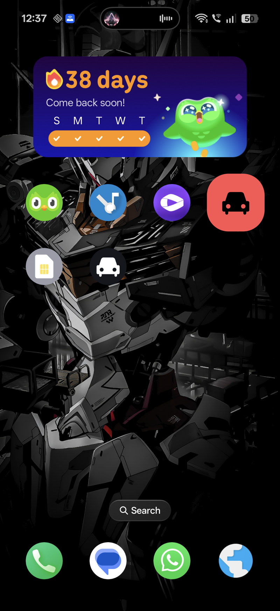
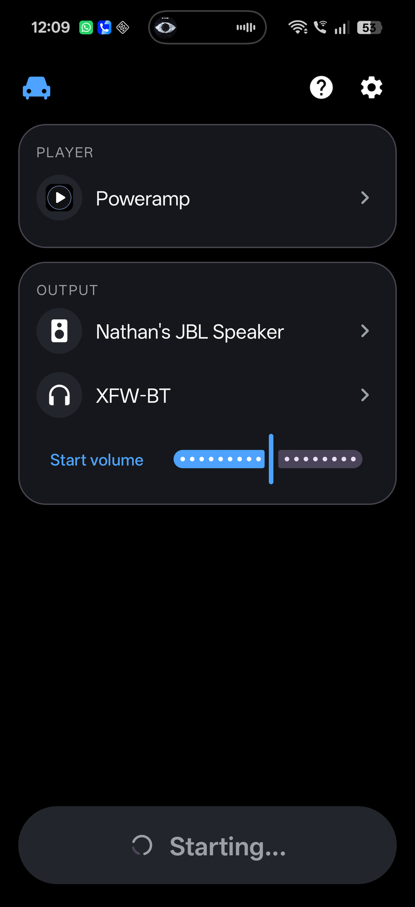

# LazyCar

One tap car mode for OnePlus (Android 16). LazyCar turns on Bluetooth, connects
two Bluetooth audio outputs, enables OnePlus Audio sharing (dual audio) on both,
optionally turns on the hotspot and mobile data, sets a start volume, launches
your music player and presses play. Tap again to STOP and restore everything
exactly as it was.

## Screenshots

  
  
  

  
  
  

## Features

- One tap to set up the car and one tap to tear it down.
- Turns Bluetooth on, connects both paired outputs, and enables OnePlus Audio
  sharing so both speakers play at once.
- Optional Wi-Fi hotspot and mobile data toggles.
- Optional start volume applied when GO runs.
- Launches your chosen music player and presses play.
- Optional launch of Open Headunit / Android Auto.
- STOP restores the exact state from before GO: it only undoes what GO turned
  on, and leaves anything that was already on untouched.
- 1x1 home screen widget, or a big GO button in the app.

## Requirements

- A OnePlus phone with the Audio sharing (dual audio) feature.
- Android 12 or newer (minSdk 31). Tested on OnePlus 15 running Android 16.
- Two Bluetooth audio outputs already paired in Android's Bluetooth settings.

## Install

Download the APK from the Releases page and install it, or build from source:

- Install JDK 17 and the Android SDK.
- Run `./gradlew assembleDebug`.
- The APK lands at `app/build/outputs/apk/debug/app-debug.apk`.

## Setup

1. Pair both Bluetooth outputs in Android's Bluetooth settings.
2. Enable Audio sharing once from the Bluetooth settings (OnePlus dual audio).
3. Open LazyCar and enable it in Settings > Accessibility.
4. Add the LazyCar 1x1 widget to your home screen.
5. In the app, pick your music player, your two outputs, and a start volume.
   Settings save themselves, there is no Save button.

Now one tap on the widget (or the GO button) runs the full sequence, and a
second tap stops and restores.

## How it works

OnePlus and Android expose no public API a side-loaded app can call to start
Audio sharing, so LazyCar drives the same system panels you would tap by hand.
An Accessibility service (`TapService`) taps the system Audio sharing panel and
the Bluetooth enable/disable prompts for you.

The privileged path exists but is blocked for normal apps. OnePlus ships
`OplusA2dpSharingManager.startSharing(...)`, but the Bluetooth server enforces
the `android.permission.BLUETOOTH_PRIVILEGED` and OnePlus
`com.oplus.permission.safe.BLUETOOTH` permissions, both `signature|privileged`,
which a Play Store or side-loaded app cannot hold. Details are in
`reverse/SHARING_API.md`.

`MediaRouter2` is the only public API that could in principle start sharing,
but that needs `MEDIA_ROUTING_CONTROL` (also privileged) and the OnePlus route
provider only advertises the speaker group after sharing is already on, so it
is not usable here. Tapping the system panel is the reliable path.

## Privacy

LazyCar makes no internet requests and collects no data. The Accessibility
service is used only to operate the listed system panels: the Audio sharing
panel, the Bluetooth enable/disable prompts, the hotspot and mobile data Quick
Settings tiles, and the volume slider. It does nothing else.

## Known limits

- OnePlus volume is shared across the whole group, so there is a single start
  volume, not one per output.
- The auto-tap depends on OnePlus SystemUI element ids. A SystemUI update can
  move them and break the tapping until LazyCar is updated.
- Reinstalling via `adb install -r` (or `am force-stop`) unbinds the
  Accessibility service on OnePlus. Re-enable it in Settings > Accessibility.

## Testing notes

Debug entry points, driven with adb against `GoActivity`:

- Sharing only: `adb shell am start -n com.lazyneil.lazycar/.GoActivity --ez shareOnly true`
- Volume only: `adb shell am start -n com.lazyneil.lazycar/.GoActivity --ez volumeOnly true`

Watch live logs with `adb logcat -v time -s LazyCar:V`.

## Project layout

- `Accent.kt` accent colour handling.
- `BtDevices.kt` paired Bluetooth device lookup.
- `GoAction.kt` the GO/STOP sequence and state snapshot/restore.
- `GoActivity.kt` translucent launcher for GO, plus debug extras.
- `GoService.kt` foreground service that runs the sequence.
- `GoWidget.kt` the 1x1 home screen widget.
- `HelpActivity.kt` in-app help screen.
- `MainActivity.kt` main screen: player, outputs, start volume, GO button.
- `Prefs.kt` saved settings.
- `SettingsActivity.kt` settings screen.
- `TapService.kt` Accessibility service that taps the system panels.
- `VolumeMath.kt` volume value mapping.

## License

MIT. See `LICENSE`.
