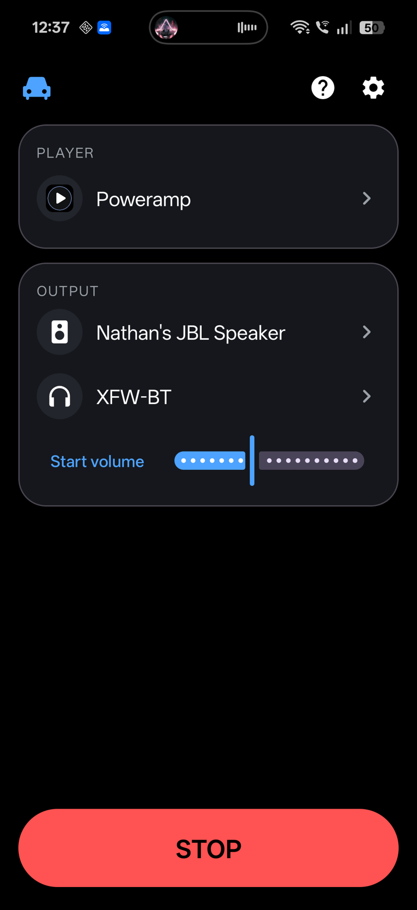
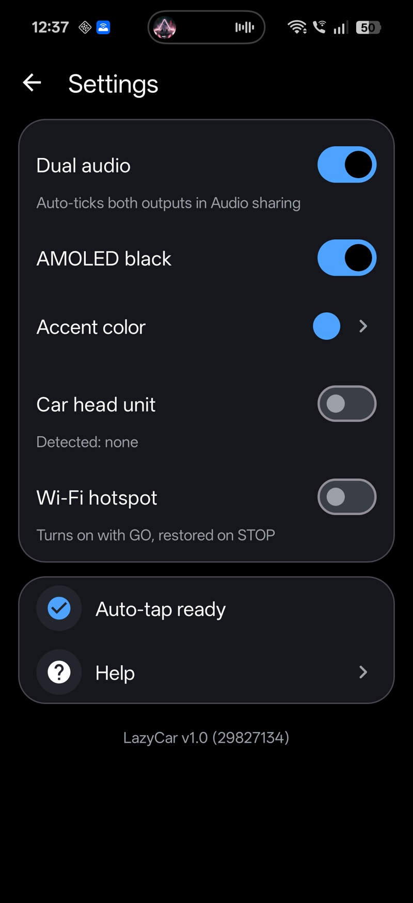
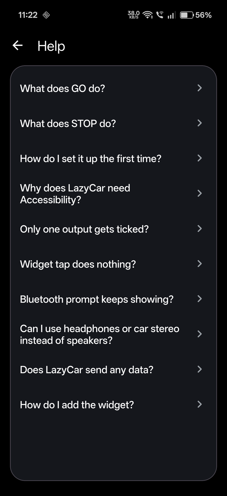

# LazyCar

**One tap car mode for OnePlus.** Bluetooth on, both speakers sharing audio, hotspot, volume, and your music playing. Tap again to put it all back.

GO screen &nbsp;&bull;&nbsp; Settings &nbsp;&bull;&nbsp; Help

## GO and STOP

One tap runs the full sequence, a second tap stops and restores. STOP only undoes what GO turned on, and leaves anything that was already on untouched.

| GO does | STOP does |
| --- | --- |
| Turns Bluetooth on | Restores the exact state from before GO |
| Connects both paired outputs | Disconnects only the outputs GO connected |
| Enables OnePlus Audio sharing (dual audio) | Turns Audio sharing off if GO turned it on |
| Optionally turns on hotspot and mobile data | Reverts hotspot and mobile data it changed |
| Sets an optional start volume | Leaves already-on features untouched |
| Launches your music player and presses play | |
| Optionally launches Open Headunit / Android Auto | |

## Why this exists

This is a very niche project, and that is the point. It was built for one person, one phone, and one car.

Every drive started the same way: turn Bluetooth on, connect the first speaker, connect the second one, open the Bluetooth settings, dig into Audio sharing and tick both speakers, turn on the hotspot, open the music app, press play, then fix the volume because OnePlus resets it to max when the group forms. Around ten taps across four different screens, every single time, and the same again in reverse when parking. OnePlus dual audio has no shortcut, no widget, no automation hook, and no public API, so nothing in Tasker, Bixby-style routines, or Android Auto could do it.

LazyCar collapses all of that into one tap on a home screen widget, and one more tap to put everything back exactly as it was. It targets OnePlus phones with the Audio sharing feature, two Bluetooth speakers in a car, and nothing else. If that is not your setup, this app will do very little for you. If it is, it saves a minute of fiddling every time you get in the car.

## Features

| | |
| --- | --- |
| **One tap setup and teardown** | GO to set up the car, tap again to tear it down. |
| **Dual audio** | Connects both paired outputs and enables OnePlus Audio sharing so both speakers play at once. |
| **Connectivity** | Optional Wi-Fi hotspot and mobile data toggles. |
| **Start volume** | Optional volume applied when GO runs. |
| **Music** | Launches your chosen player and presses play. |
| **Head unit** | Optional launch of Open Headunit / Android Auto. |
| **Exact restore** | STOP undoes only what GO turned on. |
| **Home screen widget** | 1x1 GO widget, or a big GO button in the app. |

## Requirements

- A OnePlus phone with the Audio sharing (dual audio) feature.
- Android 12 or newer (minSdk 31). Tested on OnePlus 15 running Android 16.
- Two Bluetooth audio outputs already paired in Android's Bluetooth settings.

## Setup in 60 seconds

1. Pair both Bluetooth outputs in Android's Bluetooth settings.
2. Enable Audio sharing once from the Bluetooth settings (OnePlus dual audio).
3. Open LazyCar and enable it in Settings > Accessibility.
4. Add the LazyCar 1x1 widget to your home screen.
5. Pick your music player, your two outputs, and a start volume. Settings save themselves, there is no Save button.

Now one tap on the widget (or the GO button) runs the full sequence, and a second tap stops and restores.

## Install

Download the APK from the [Releases page](https://github.com/nathanrodrigues2111/lazycar/releases/latest) and install it, or build from source:

- Install JDK 17 and the Android SDK.
- Run `./gradlew assembleDebug`.
- The APK lands at `app/build/outputs/apk/debug/app-debug.apk`.

## Privacy

LazyCar makes no internet requests and collects no data. The Accessibility service is used only to operate the listed system panels: the Audio sharing panel, the Bluetooth enable/disable prompts, the hotspot and mobile data Quick Settings tiles, and the volume slider. It does nothing else.

## Known limits

- OnePlus volume is shared across the whole group, so there is a single start volume, not one per output.
- The auto-tap depends on OnePlus SystemUI element ids. A SystemUI update can move them and break the tapping until LazyCar is updated.
- Reinstalling via `adb install -r` (or `am force-stop`) unbinds the Accessibility service on OnePlus. Re-enable it in Settings > Accessibility.

<b>How it works (technical)</b>

 

OnePlus and Android expose no public API a side-loaded app can call to start Audio sharing, so LazyCar drives the same system panels you would tap by hand. An Accessibility service (`TapService`) taps the system Audio sharing panel and the Bluetooth enable/disable prompts for you.

The privileged path exists but is blocked for normal apps. OnePlus ships `OplusA2dpSharingManager.startSharing(...)`, but the Bluetooth server enforces the `android.permission.BLUETOOTH_PRIVILEGED` and OnePlus `com.oplus.permission.safe.BLUETOOTH` permissions, both `signature|privileged`, which a Play Store or side-loaded app cannot hold. Details are in `reverse/SHARING_API.md`.

`MediaRouter2` is the only public API that could in principle start sharing, but that needs `MEDIA_ROUTING_CONTROL` (also privileged) and the OnePlus route provider only advertises the speaker group after sharing is already on, so it is not usable here. Tapping the system panel is the reliable path.

<b>Testing notes</b>

 

Debug entry points, driven with adb against `GoActivity`:

- Sharing only: `adb shell am start -n com.lazyneil.lazycar/.GoActivity --ez shareOnly true`
- Volume only: `adb shell am start -n com.lazyneil.lazycar/.GoActivity --ez volumeOnly true`

Watch live logs with `adb logcat -v time -s LazyCar:V`.

<b>Project layout</b>

 

| File | Purpose |
| --- | --- |
| `Accent.kt` | Accent colour handling. |
| `BtDevices.kt` | Paired Bluetooth device lookup. |
| `GoAction.kt` | The GO/STOP sequence and state snapshot/restore. |
| `GoActivity.kt` | Translucent launcher for GO, plus debug extras. |
| `GoService.kt` | Foreground service that runs the sequence. |
| `GoWidget.kt` | The 1x1 home screen widget. |
| `HelpActivity.kt` | In-app help screen. |
| `MainActivity.kt` | Main screen: player, outputs, start volume, GO button. |
| `Prefs.kt` | Saved settings. |
| `SettingsActivity.kt` | Settings screen. |
| `TapService.kt` | Accessibility service that taps the system panels. |
| `VolumeMath.kt` | Volume value mapping. |

## License

MIT. See [`LICENSE`](LICENSE).

---

Built with Kotlin, Material 3, and one Accessibility service.

